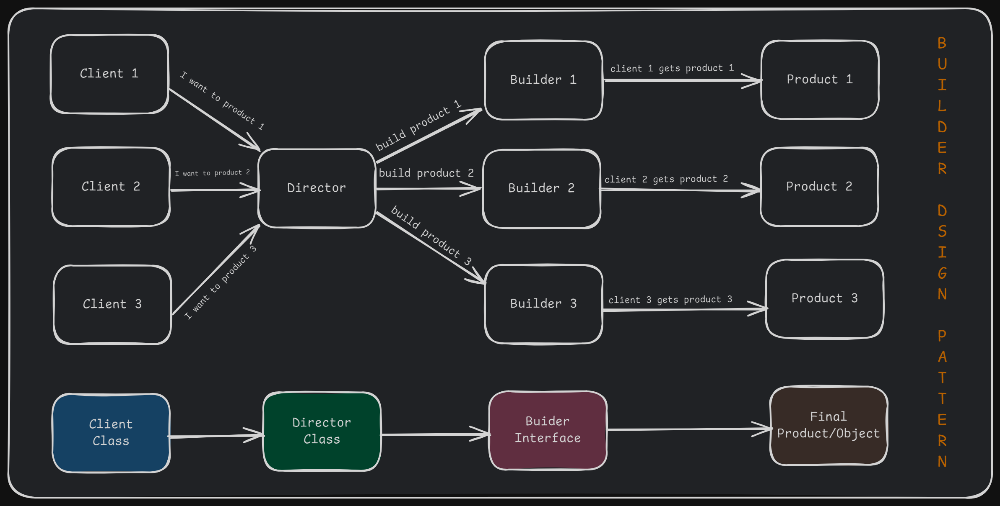
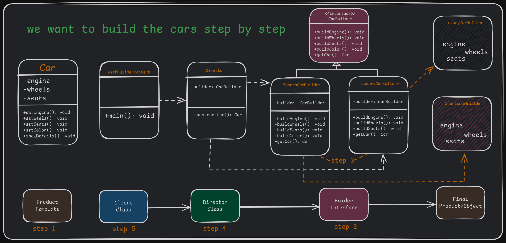

# Creational Design Pattern

Creational design patterns deal with object creation mechanisms, trying to create objects in a manner suitable to the situation.
The basic form of object creation could result in design problems or added complexity to the design. Creational design patterns
solve this problem by controlling the object creation process.

## Types Of Creation Design Pattern:
1. Singleton Pattern
2. Factory Method Pattern
3. Abstract Factory Pattern
4. Builder Pattern
5. Prototype Pattern

---

# Singleton Pattern in Java

## The Singleton Pattern

The Singleton Pattern ensures that a class has only one instance and provides a global access point to it.
Its says that mai ek class ka single instance hi banane dunga us single object k alawa kuch aur nhi banane dunga.

## Where to use Singleton Pattern:
When only one instance of a class is required (e.g. Logger, database connection, driver objects, etc.)

## Why to use Singleton Pattern:
To ensure a single point of access to the object.
To save resources by creating an object only once.

## Key components of Singleton Pattern:

1. **Private Constructor**: To prevent instantiation of the class from other classes.
2. **Static Instance**: To hold the single instance of the class and it is initially null.
3. **Static Method**: To return the single instance of the class.
4. **Singleton Class**: The class that controls its own instance and prevents creating multiple instances.
5. **Global Access Point**: To access the single instance of the class.

### 1. Use Cases of Singleton Pattern

Singleton is useful when you need one shared instance of a class, such as:

✅ **Logging System** → Ensure all classes log messages to the same instance.\
✅ **Database Connection** → Avoid multiple connections to the same database.\
✅ **Thread Pool** → Single point of thread management.\
✅ **Cache Management** → Global caching to avoid redundant data fetching.\
✅ **Configuration Manager** → Single instance managing application settings.

### 2. Singleton Pattern Class Diagram
```
        +--------------------------------+
        |   Singleton                    |  
        +--------------------------------+
        | - instance: Singleton (static) |
        | - Singleton() (private)        |
        +--------------------------------+
        | + getInstance(): Singleton     |
        | + showMessage(): void          |
        +--------------------------------+
```


### 3. Thread-Safe Singleton Using Double-Checked Locking

```java
class Singleton {
    // staticmember holds only one instance of the Singleton class & it is initially null.
    private static volatile Singleton instance; // Volatile ensures thread safety

    private Singleton() {
        System.out.println("Singleton Instance Created!");
    } // Private constructor prevents instantiation
   
    // Static factory method to provide the global point of access to the Singleton instance
    public static Singleton getInstance() {
        if (instance == null) { // First check
            synchronized (Singleton.class) { // Thread safety
                if (instance == null) { // Second check

                    // If there is no instance available, create a new one 
                    instance = new Singleton();
                }
            }
        }

        // Return the single instance
        return instance;
    }

    public void showMessage() {
        System.out.println("Singleton Instance Created!");
    }
}

// Client Code
public class SingletonDemo {
    public static void main(String[] args) {
        Singleton obj1 = Singleton.getInstance();
        obj1.showMessage();

        Singleton obj2 = Singleton.getInstance();
        System.out.println(obj1 == obj2); // Output: true (Both references point to the same instance)
    }
}
```

### 4. Explanation of the Implementation

✔ **Key Features:**

- **Private Constructor** → Prevents direct instantiation.
- **Static Instance Variable** → Stores the single instance.
- **getInstance() Method** → Returns the single instance, creating it only when needed.
- **Double-Checked Locking** → Ensures thread safety with minimal performance overhead.
- **Volatile Keyword** → Ensures visibility of instance changes across threads.

### 5. Bill Pugh Singleton (Best Practice - Uses Inner Static Helper Class)

```java
class Singleton {
    private Singleton() {}

    private static class SingletonHelper {
        private static final Singleton INSTANCE = new Singleton();
    }

    public static Singleton getInstance() {
        return SingletonHelper.INSTANCE;
    }
}
```

### 6. Summary

| Approach               | Lazy Initialization?   | Thread Safe? | Performance                         |
| ---------------------- | --------------------   | ------------ | ----------------------------------- |
| Eager Initialization   | ❌ No                 | ✅ Yes        | ❌ Creates instance even if not used |
| Double-Checked Locking | ✅ Yes                | ✅ Yes        | ✅ Efficient                         |
| Bill Pugh Singleton    | ✅ Yes                | ✅ Yes        | ✅ Best practice                     |


### Advantages of Singleton Pattern:
1. Ensure a single instance across the application.
2. Save resources by avoiding multiple object creation.
3. Provide controlled access to the single instance.

### Disadvantages of Singleton Pattern:
1. Difficult to unit test as it introduces global state.
2. May lead to tight coupling with the client code.
3. Thread-safety issues if not implemented correctly in a multi-threaded environment.

---

# Factory Method Pattern in Java

## The Factory Method Pattern

The Factory Method Pattern provides an interface for creating objects without specifying their exact class. It lets subclasses decide which class to instantiate, promoting loose coupling.

## Where to use Factory Method Pattern:
When a class can't anticipate the class of objects it must create.
When a class wants its subclasses to specify the objects it creates.
When a class wants to delegate the responsibility of object creation to one of the several helper subclasses.


## Why to use Factory Method Pattern:
It makes your code more robust, less coupled, and easier to extend.
You can add new types of objects without modifying the existing code.

**Example:**  A mobile phone company making phones of different models (e.g., Android, iPhone) using the same manufacturing process.


## Key Components of Factory Method Pattern:
```
                    +---------------------+
                    | Product (Interface) |     
                    +---------------------+
                              ^
                              |
                ----------------------------------
                |                                |
        +---------------------+       +---------------------+
        | ConcreteProductA    |       | ConcreteProductB    |
        +---------------------+       +---------------------+
                ^                                ^
                |                                |
                ----------------------------------
                                |
                    +---------------------+
                    | Factory (Abstract)  |
                    +---------------------+
```


1. Factory: A clasas or method that creates objects.
2. Product: The objects created by the factory.
3. Concrete Product: The  actual objects (e.g., Android Phone, iPhone) created by the factory.

## Principle of Factory Method Pattern:
The factory method uses polymorphism to decide which object to create based on the input parameters or the factory subclass.

### 1. Use Cases of Factory Method Pattern

The Factory Method Pattern is useful when:

✅ **Database Connections** → Different databases (MySQL, PostgreSQL) require different connection objects.\
✅ **Notification System** → Creating SMS, Email, or Push notifications without modifying client code.\
✅ **Logging Framework** → Different logging mechanisms (Console, File, Cloud).\
✅ **Shape/Document Editor** → Creating different shapes (Circle, Square) dynamically.\
✅ **Payment Processing** → Supporting multiple payment gateways like PayPal, Stripe, etc.


# Factory Design Pattern Implementation

## 2. Code Explanation
### Without Factory Design Pattern
```
+------------------+
|  WithoutFactory  |
+------------------+--------------
| main()           |             |
+------------------+             |
       |                         |
       v                         v
+------------------+     +------------------+
|  AndroidPhone    |     |  IPhone           |
+------------------+     +------------------+
| display()        |     | display()        |
+------------------+     +------------------+
```

```java
class AndroidPhone {
    void display() {
        System.out.println("Android Phone");
    }
}

class IPhone {
    void display() {
        System.out.println("iPhone");
    }
}

public class WithoutFactory {
    public static void main(String[] args) {
        AndroidPhone androidPhone = new AndroidPhone();
        IPhone iPhone = new IPhone();
        
        androidPhone.display();
        iPhone.display();
    }
}
```
### Problems in This Approach
- The `WithoutFactory` class directly creates instances of `AndroidPhone` and `IPhone`.
- There is no abstraction or centralized management of object creation.

### With Factory Design Pattern
```
+-----------------------------+
|      Phone                  | Product
+-----------------------------+
| display()    (Interface)    |
+-----------------------------+
                ^
                | (implements)
    ------------------------------
    |                            |
+------------------+     +------------------+
|  AndroidPhone    |     |  IPhone          |
+------------------+     +------------------+
| display()        |     | display()        |
+------------------+     +------------------+
        ^                        ^
        |                        |
        --------------------------
              |
              v
+------------------+
|  PhoneFactory    | Factory
+------------------+
| getPhone(type)   |
+------------------+
        |
        v
+------------------+
|  WithFactory     |
+------------------+
| main()          |
+------------------+

```


```java
// Step 1: Create an interface (Product)
interface Phone {
    void display();
}

// Step 2: Create concrete classes (Concrete Products)
class AndroidPhone implements Phone {
    public void display() {
        System.out.println("Android Phone");
    }
}

class IPhone implements Phone {
    public void display() {
        System.out.println("iPhone");
    }
}

// Step 3: Create a factory class (Factory)
class PhoneFactory {
    public static Phone getPhone(String type) {
        if (type.equalsIgnoreCase("android")) {
            return new AndroidPhone();
        } else if (type.equalsIgnoreCase("iphone")) {
            return new IPhone();
        }
        return null;
    }
}

// Step 4: Use the factory in the main method
public class WithFactory {
    public static void main(String[] args) {
        Phone android = PhoneFactory.getPhone("android");
        Phone iphone = PhoneFactory.getPhone("iphone");
        
        android.display();
        iphone.display();
    }
}
```
### Benefits of This Approach
- Object creation logic is centralized in `PhoneFactory`.
- Adding new phone types requires minimal changes.
- The main code interacts with the `Phone` interface rather than concrete implementations, promoting loose coupling.

## 3. Use Cases
The Factory Design Pattern is widely used in various applications, including:
- **Payment gateways** (e.g., PayPal, Stripe)
- **Vehicle manufacturing** (e.g., Car, Bike)
- **Database connections** (e.g., MySQL, MongoDB)

## 4. Advantages & Disadvantages
### Advantages
1. **Loose Coupling**: The main code is not tightly tied to specific classes.
2. **Scalability**: Adding new product types is easy.
3. **Maintenance**: Code is more organized and manageable.

### Disadvantages
1. **Complexity**: Adds extra layers (interface, factory), making the code slightly more complex.
2. **Limited Customization**: The factory may not handle very unique object requirements.

## 5. Conclusion
By using the Factory Design Pattern, your code becomes cleaner, more flexible, and easier to manage. This approach is particularly useful when object creation logic is complex or requires a high level of maintainability.

---


# Abstract Factory Pattern in Java

The **Abstract Factory Pattern** provides an interface for creating families of related objects without specifying their concrete classes. It is used when multiple factories need to create objects belonging to different categories.

## Where to use Abstract Factory Pattern:
When a system should be independent of how its objects are created, composed, and represented.
When a system should be configured with one of multiple families of objects.
When a family of related product objects is designed to be used together.

## Why to use Abstract Factory Pattern:
To group object creation logic for related objects.
To maintain flexibility and scalability in object creation.

Example- A phone manufacturer producing different models of phones (e.g., Android, iPhone) with their respective companies (e.g., Samsung, Apple).

## Key Components of Abstract Factory Pattern:
1. **Abstract Factory:** An interface or abstract class to create family of objects.
2. **Concrete Factory:** Implements the abstract factory to create specific product families.
3. **Abstract Product:** An interface or abstract class for a type of product.
4. **Concrete Product:** Implements the abstract product for a specific family.
5. **Client:** Uses the factories and products.

## Principle Method of Abstract Factory Pattern:
use the factory of factories concept, Where the clients only interacts with the abstract factory and abstract productt interfaces.

## 1. Use Cases of Abstract Factory Pattern

- **Cross-Platform UI Toolkits** → Creating UI elements (Buttons, Checkboxes) that work across different OS (Windows, Mac, Linux).
- **Database Connection Factory** → Supporting multiple databases (MySQL, PostgreSQL, MongoDB) without modifying client code.
- **Theme-Based UI Factories** → Generating UI components based on different themes (Dark Theme, Light Theme).
- **Cloud Service Providers** → Factory for different cloud services (AWS, Azure, Google Cloud).

# Abstract Factory Design Pattern Implementation

## 2. Code Explanation
### Without Abstract Factory Pattern
```
+------------------+
|    Main Class   |
|  WithoutFactory |
+------------------+
        |
        | Creates instances directly
        v
+-------------------------------------------+
|     PhoneFactory   (Static Factory)       |  
+-------------------------------------------+
        |                             |
        | Returns Objects             |
        v                             v
+----------------------+   +----------------------+
|    AndroidPhone      |   |      IPhone         |
|  (Concrete Class)    |   |   (Concrete Class)  |
+----------------------+   +----------------------+
        |                            |
        | Implements                 | Implements
        v                            |
+----------------------+             |
|       Phone          |             |
|    (Interface)       |<-------------
+----------------------+
```


```java
interface Phone {
    void display();
}

class AndroidPhone implements Phone {
    public void display() {
        System.out.println("Android Phone");
    }
}

class IPhone implements Phone {
    public void display() {
        System.out.println("iPhone");
    }
}

class PhoneFactory {
    public static Phone getPhone(String type) {
        if (type.equalsIgnoreCase("android")) {
            return new AndroidPhone();
        } else if (type.equalsIgnoreCase("iphone")) {
            return new IPhone();
        }
        return null;
    }
}

public class WithoutAbstractFactory {
    public static void main(String[] args) {
        Phone android = PhoneFactory.getPhone("android");
        Phone iphone = PhoneFactory.getPhone("iphone");
        
        android.display();
        iphone.display();
    }
}
```
### Output
```
Android Phone
iPhone
```
### Problems in This Approach
- The `PhoneFactory` directly creates objects, leading to tight coupling.
- Extending the code requires modifying the existing factory class.

### With Abstract Factory Pattern
```
+----------------------+
|     Main Class       |
|  WithAbstractFactory |
+----------------------+
        |
        | Calls FactoryProducer
        v
+------------------------+
|   FactoryProducer      |--------------
| (Factory of Factories) |             |
+------------------------+             |
        |                              |
        | Returns Specific Factory     | Returns Specific Factory
        v                              v
+----------------------+   +----------------------+
|   AndroidFactory    |   |    IPhoneFactory     |
|  (Concrete Factory) |   |  (Concrete Factory)  |
+----------------------+   +----------------------+
        |                        |
        | Implements             | Implements
        v                        v
+----------------------+   +----------------------+
|    PhoneFactory     |   |    PhoneFactory     |
|    (Interface)      |   |    (Interface)      |
+----------------------+   +----------------------+
        |                        |
        | Creates Objects        | Creates Objects
        v                        v
+----------------------+   +----------------------+
|    AndroidPhone      |   |      IPhone          |
|  (Concrete Class)    |   |   (Concrete Class)   |
+----------------------+   +----------------------+
        |                             |
        | Implements                  | Implements
        v                             |
+----------------------+              |
|       Phone          |              |
|    (Interface)       |<--------------
+----------------------+


```


```java
// Step 1: Create an interface (Abstract Product)
interface Phone {
    void display();
}

// Step 2: Create concrete classes (Concrete Products)
class AndroidPhone implements Phone {
    public void display() {
        System.out.println("Android Phone");
    }
}

class IPhone implements Phone {
    public void display() {
        System.out.println("iPhone");
    }
}

// Step 3: Create an abstract factory (Abstract Factory)
interface PhoneFactory {
    Phone createPhone();
}

// Step 4: Create concrete factories (Concrete Factories)
class AndroidFactory implements PhoneFactory {
    public Phone createPhone() {
        return new AndroidPhone();
    }
}

class IPhoneFactory implements PhoneFactory {
    public Phone createPhone() {
        return new IPhone();
    }
}

// Step 5: Create a factory producer (Factory of Factories)
class FactoryProducer {
    public static PhoneFactory getFactory(String type) {
        if (type.equalsIgnoreCase("android")) {
            return new AndroidFactory();
        } else if (type.equalsIgnoreCase("iphone")) {
            return new IPhoneFactory();
        }
        return null;
    }
}

// Step 6: Use the abstract factory in the main method
public class WithAbstractFactory {
    public static void main(String[] args) {
        PhoneFactory androidFactory = FactoryProducer.getFactory("android");
        PhoneFactory iphoneFactory = FactoryProducer.getFactory("iphone");
        
        Phone android = androidFactory.createPhone();
        Phone iphone = iphoneFactory.createPhone();
        
        android.display();
        iphone.display();
    }
}
```
### Output
```
Android Phone
iPhone
```
### Benefits of This Approach
- **Encapsulation**: Object creation is abstracted and separated from the client.
- **Scalability**: New phone types can be added without modifying existing classes.
- **Loose Coupling**: The client code doesn’t depend on concrete implementations.

## 3. Use Cases
The Abstract Factory Pattern is widely used in various applications, including:
- **Payment gateways** (e.g., PayPal, Stripe)
- **Vehicle manufacturing** (e.g., Car, Bike)
- **Database connections** (e.g., MySQL, MongoDB)

## 4. Advantages & Disadvantages
### Advantages
1. **Encapsulation**: Factory encapsulates object creation logic.
2. **Scalability**: New product families can be easily added.
3. **Loose Coupling**: The main application is not tightly bound to specific implementations.

### Disadvantages
1. **Complexity**: More classes and interfaces increase code complexity.
2. **Inflexibility**: Requires modification if new factory variations are needed.

## 5. Conclusion
By using the Abstract Factory Design Pattern, your code becomes more modular, flexible, and easy to maintain. This pattern is ideal for applications requiring a structured object creation mechanism while maintaining loose coupling.


---


# Builder Pattern in Java

The Builder Design Pattern is a creational pattern used to construct complex objects step by step. Unlike the Factory pattern, which creates objects in one go, the Builder pattern allows building parts of the object incrementally and flexibly.

## 2. Where and Why Do We Use It?
### Where to Use:
- When creating complex objects with many optional parameters or configurations.
- When constructing objects in a step-by-step manner.

### Why to Use:
- To simplify object creation when there are many parameters.
- To avoid having a large constructor with multiple arguments.
- To improve the readability and maintainability of code.

## 3. Key Components
### Builder Design Pattern




- **Builder**: An abstract class or interface defining the steps to build the product.
- **Concrete Builder**: Implements the Builder interface to construct and assemble parts of the product.
- **Product**: The final object being built.
- **Director (Optional)**: Controls the object creation process using the Builder. (Director gives the instructions to the builder to build the final product.)
- **Client**: The Client is the code that initiates the construction of the complex object. It creates a Builder object and passes it to the Director to initiate the construction process. The Client may retrieve the final product from the Builder after construction is complete.

## 4. Principle Method
The pattern separates the construction logic (handled by the builder) from the representation of the final product. This ensures flexibility and makes the construction process reusable and independent.

## 5. Examples of Real-World Scenario
### Examples of Real-World Scenario
- **House Construction**: Building a house involves steps like constructing walls, adding a roof, installing doors, etc., which can vary based on the type of house.
- **Restaurant Meal Order**: You can build a meal by choosing optional components like a drink, dessert, or side dish.


## 6. Code Without Pattern
```java
// Product Class
class Car {
    private String engine;
    private String wheels;
    private String seats;
    private String color;

    // Construct a car with engine, wheels and seats
    public Car(String engine, String wheels, String seats, String color) {
        this.engine = engine;
        this.wheels = wheels;
        this.seats = seats;
        this.color = color;
    }

    public void showDetails() {
        System.out.println("Car with Engine: " + engine + ", Wheels: " + wheels + ", Seats: " + seats + ", Color: " + color);
    }
}

// Client Code
public class WithoutBuilderPattern {
    public static void main(String[] args) {
        Car car = new Car("V6", "MRF", "Leather", "Red");
        car.showDetails(); // Car with Engine: V6, Wheels: MRF, Seats: Leather, Color: Red
    }
}
```
### In this code:
- The constructor becomes difficult to manage with more parameters.
- Hard to read and maintain the code when object creation logic changes.

## 7. Code With Pattern



### With Builder Design Pattern
```java
// Step 1: Product Class
class Car {
    private String engine;
    private String wheels;
    private String seats;
    private String color;

    public void setEngine(String engine) { this.engine = engine; }
    public void setWheels(String wheels) { this.wheels = wheels; }
    public void setSeats(String seats) { this.seats = seats; }
    public void setColor(String color) { this.color = color; }

    public void showDetails() {
        System.out.println("Car with Engine: " + engine + ", Wheels: " + wheels + ", Seats: " + seats + ", Color: " + color);
    }
}

// Step 2: Builder Interface
interface CarBuilder {
    void buildEngine();
    void buildWheels();
    void buildSeats();
    void buildColor();
    Car getCar();
}

// Step 3: Concrete Builder
class SportsCarBuilder implements CarBuilder {
    private Car car;

    public SportsCarBuilder() {
        car = new Car();
    }

    // Step by step construction of the car
    @Override
    public void buildEngine() { car.setEngine("V8"); }
    @Override
    public void buildWheels() { car.setWheels("Sports Alloy"); }
    @Override
    public void buildSeats() { car.setSeats("Racing Seats"); }
    @Override
    public void buildColor() { car.setColor("Red"); }
    @Override
    public Car getCar() { return car; }
}

// Step 4: Director
class Director {
    private CarBuilder builder;

    public Director(CarBuilder builder) {
        this.builder = builder;
    }

    // Method to construct the car
    public Car constructCar(boolean wantColor) {
        if (wantColor) {
            builder.buildColor();
        }
        builder.buildEngine();
        builder.buildWheels();
        builder.buildSeats();
        return builder.getCar();
    }
}

// Step 5: Client Code
public class WithBuilderPattern {
    public static void main(String[] args) {
        CarBuilder builder = new SportsCarBuilder();
        Director director = new Director(builder);

        Car car = director.constructCar(true);
        car.showDetails(); // Output: Car with Engine: V8, Wheels: Sports Alloy, Seats: Racing Seats, Color: Red
    }
}
```
### In this code:
- Flexibility in object construction.
- Makes code more readable and easier to maintain.
- Supports optional parameters easily.

## 8. Use Cases
- Creating complex objects like cars, meals, or houses.
- Building UI components with many configuration options.
- Constructing objects that require a specific sequence of steps.

## 9. Advantages & Disadvantages
### Advantages
1. **Readability**: Easier to understand and maintain.
2. **Flexibility**: Allows optional parameters without overloading constructors.
3. **Modularity**: Each builder handles its own construction logic.

### Disadvantages
1. **Complexity**: Requires additional classes like Director and Builder.
2. **Overhead**: May feel excessive for simple objects.

---


# Prototype Pattern in Java

The **Prototype Pattern** is a creational design pattern used when object creation is costly, and we need to create multiple copies of an object efficiently. Instead of creating new instances, it clones existing ones.

## 1. Use Cases of Prototype Pattern

✅ **Memory Optimization** → Avoids expensive object creation (e.g., deep-copying game characters or assets).  
✅ **Performance Improvement** → Efficient for objects that require complex initialization (e.g., database connections, configurations).  
✅ **Undo/History Mechanism** → Used in text editors and version control systems.  
✅ **Cloning Complex Objects** → Helpful when objects have many fields or nested objects (e.g., deep cloning in JSON/XML parsers).  
✅ **Distributed Systems** → Reduces overhead by sending object copies instead of constructing new instances.  

## 2. Prototype Pattern Class Diagram

```
        +----------------------+
        |   Prototype         |  (Interface)
        +----------------------+
        | + clone() : Object  |
        +----------------------+
                  ▲
                  │
     ---------------------------------
     |                               |
+----------------------+     +----------------------+
|   ConcretePrototypeA |     | ConcretePrototypeB   |
+----------------------+     +----------------------+
| - field1             |     | - field2             |
| - field2             |     | - field3             |
| + clone()            |     | + clone()            |
+----------------------+     +----------------------+
```

## 3. Java Implementation of Prototype Pattern

### Step 1: Define the Prototype Interface

```java
// Step 1: Prototype Interface
interface Prototype extends Cloneable {
    Prototype clone();
}
```

### Step 2: Create Concrete Prototype Classes

```java
// Step 2: Concrete Prototype - Employee
class Employee implements Prototype {
    private String name;
    private String department;

    public Employee(String name, String department) {
        this.name = name;
        this.department = department;
    }

    @Override
    public Prototype clone() {
        return new Employee(name, department);
    }

    public void showDetails() {
        System.out.println("Employee: " + name + ", Department: " + department);
    }
}

// Step 2: Concrete Prototype - Project
class Project implements Prototype {
    private String projectName;
    private int duration;

    public Project(String projectName, int duration) {
        this.projectName = projectName;
        this.duration = duration;
    }

    @Override
    public Prototype clone() {
        return new Project(projectName, duration);
    }

    public void showDetails() {
        System.out.println("Project: " + projectName + ", Duration: " + duration + " months");
    }
}
```

### Step 3: Client Code for Cloning Objects

```java
// Step 3: Client Code
public class PrototypePatternDemo {
    public static void main(String[] args) {
        // Create Original Objects
        Employee emp1 = new Employee("John Doe", "Engineering");
        Project project1 = new Project("AI Research", 12);

        // Clone Objects
        Employee emp2 = (Employee) emp1.clone();
        Project project2 = (Project) project1.clone();

        // Display Details
        emp1.showDetails();
        emp2.showDetails();
        project1.showDetails();
        project2.showDetails();
    }
}
```

## 4. Key Features

- **Prototype Interface (`Prototype`)** → Declares the `clone()` method for cloning objects.
- **Concrete Prototypes (`Employee`, `Project`)** → Implements `clone()` to return a new instance with the same attributes.
- **Client (`PrototypePatternDemo`)** → Uses `clone()` instead of creating new objects manually.
- **`clone()` Method** → Creates a new instance of the same class with the same attributes.

## 5. Cloning Mechanisms

### ✅ Shallow Cloning (Default)

Copies primitive fields but shares references for objects.

```java
@Override
public Prototype clone() {
    try {
        return (Prototype) super.clone(); // Shallow Copy
    } catch (CloneNotSupportedException e) {
        throw new RuntimeException(e);
    }
}
```

🔹 **Issue**: Changes in one clone affect the other if they share reference types.

### ✅ Deep Cloning (Manual Cloning of Nested Objects)

Each object is recursively cloned to avoid reference issues.

```java
@Override
public Prototype clone() {
    return new Employee(new String(name), new String(department)); // Deep Copy
}
```

## 6. Real-World Examples of Prototype Pattern

| **Use Case**               | **Explanation**                                       |
|----------------------------|-----------------------------------------------------|
| **Document Cloning**       | Google Docs duplicating templates                  |
| **Game Object Cloning**    | Character skins or enemy AI duplication            |
| **Database Query Results** | Cloning fetched objects for caching                |
| **AI Model Instances**     | Copying AI models with pretrained weights          |
| **Version Control Systems** | Git branches and commit snapshots                 |

---
